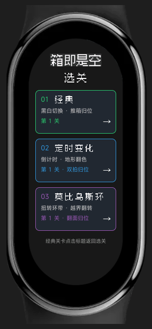
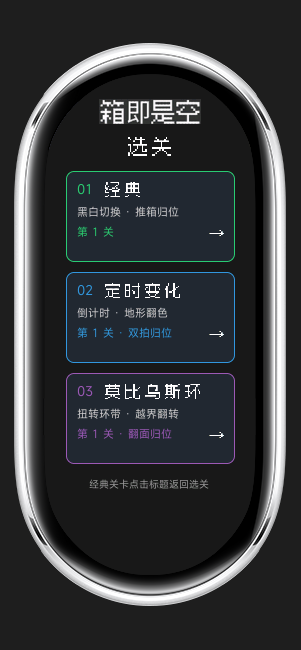
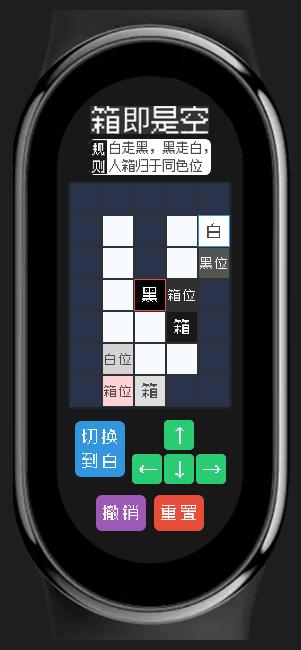
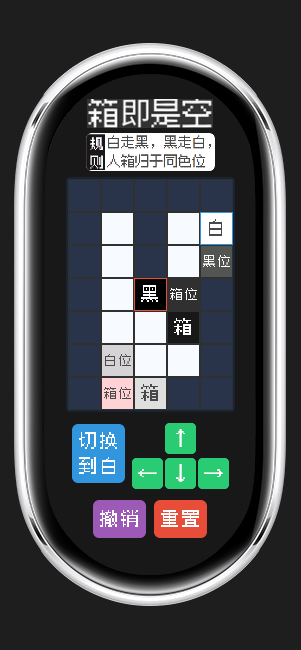
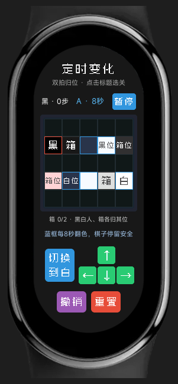
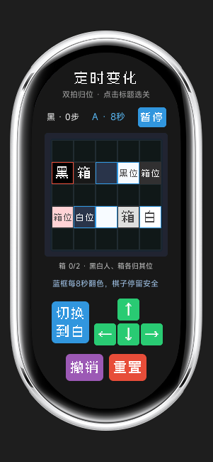
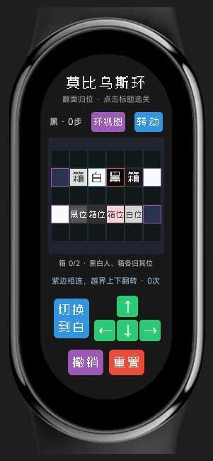
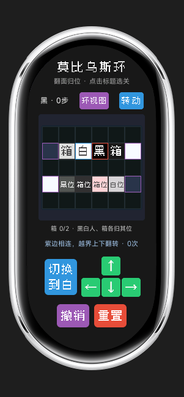
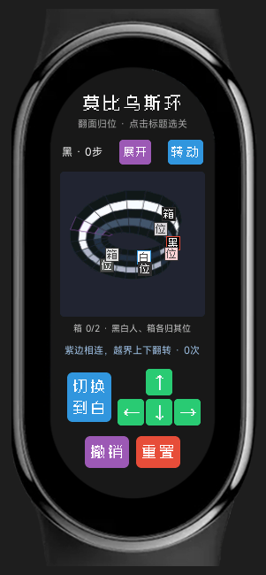
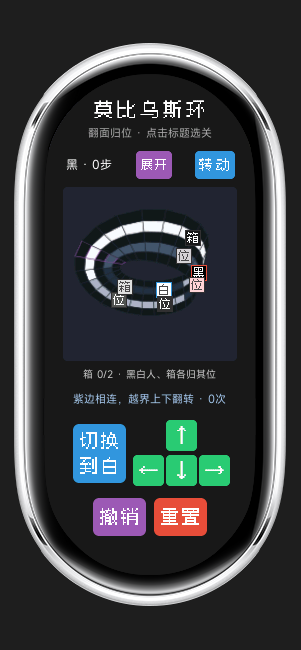

## 快速上手

小米手环上的《箱即是空》游戏（开发中）。

当前版本 **V2.0.0**，提供选关界面，以及经典、定时变化、莫比乌斯环三种模式，每种模式各有一个可通关关卡。支持切换角色、撤销、重置和通关后重玩。

米坛社区资源链接：https://www.bandbbs.cn/resources/5388/

内有 rpk 可下载，也可以直接下载本仓库中的 [V2.0.0 签名发布包](dist/com.boxorvoid.demo.release.2.0.0.rpk)，安装到手环上玩。

原作：独门Lohh，原作游戏在steam上有Win版免费demo试玩，推荐去玩。

## 界面展示

以下为 **Mi Band 9 / Mi Band 10 模拟器的实际运行截图**，叠加 AIoT IDE SDK 对应机型的机身边框；并非相机拍摄的真机照片。原始屏幕分辨率分别为 192×490 和 212×520。点击图片可以查看大图。

| 界面 | Mi Band 9 | Mi Band 10 |
| --- | --- | --- |
| 选关界面 | <a href="docs/screenshots/miband9-select.png"></a> | <a href="docs/screenshots/miband10-select.png"></a> |
| 经典关卡 | <a href="docs/screenshots/miband9-classic.png"></a> | <a href="docs/screenshots/miband10-classic.png"></a> |
| 定时变化 · 双拍归位 | <a href="docs/screenshots/miband9-timed.png"></a> | <a href="docs/screenshots/miband10-timed.png"></a> |
| 莫比乌斯环 · 展开图 | <a href="docs/screenshots/miband9-mobius-unfolded.png"></a> | <a href="docs/screenshots/miband10-mobius-unfolded.png"></a> |
| 莫比乌斯环 · 环视图 | <a href="docs/screenshots/miband9-mobius-ring.png"></a> | <a href="docs/screenshots/miband10-mobius-ring.png"></a> |

定时变化关卡每 8 秒翻转指定地形；莫比乌斯环关卡在左右接缝处翻转角色和箱子的上下位置，展开图与环视图共用同一游戏状态。详细规则与参考解法见 [关卡设计](docs/playable-levels.md)。

## 开发与验证

使用 Node.js 18.18 或以上版本，在项目根目录执行：

```sh
npm install
npm test
npm run lint
npm run build
npm run release
```

Windows PowerShell 若提示禁止运行 `npm.ps1`，将以上命令中的 `npm` 换成 `npm.cmd`。

自动测试覆盖移动和推箱规则、撤销与重置、胜利条件、页面跳转、倒计时与暂停、莫比乌斯接缝、192×490 / 212×520 屏幕适配，以及三种模式的完整通关路线。

`npm run build` 生成调试包 `dist/com.boxorvoid.demo.debug.2.0.0.rpk`；`npm run release` 使用项目签名生成正式发布包 `dist/com.boxorvoid.demo.release.2.0.0.rpk`。