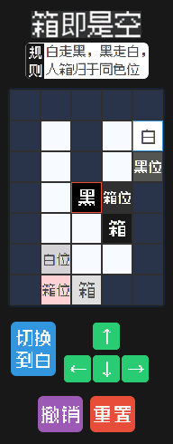
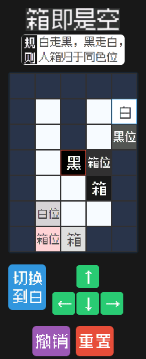

# 优化与验证记录

验证日期：2026-09-21。环境：Windows、Node.js 24.21.0、aiot-toolkit 2.0.5；模拟器使用本机的 Vela-watch-5.0 镜像。

## 已修复与优化

- 引入 `@system.prompt`，修复无效移动和空撤销的提示调用。
- 使用 `device.getInfo().screenWidth` 适配屏幕；设备信息返回前和获取失败时都有默认尺寸。
- 修复胜利页的参数读取和重玩路由，使用 `replace` 避免每次通关增加页面栈；当前只有一关，移除无实际下一关的按钮。
- 每个按钮单独管理反馈定时器，离开页面时清理。
- 游戏和撤销历史退出模板的响应式状态；一次移动只计算一次棋盘和胜利状态，保留格子对象并只更新变化的属性。
- 目标点缓存整关复用，箱子缓存只在推箱、撤销和初始化时更新；复制初始关卡数据，保证重置不会受到之前推箱操作影响。
- 补齐步数初始化与撤销恢复；修复动态角色边框被固定样式覆盖。
- 空图标路径使用空字符串，避免模拟器拒绝 `null` 属性更新。移除不受当前模拟器支持的 emoji 和 `gap` 样式；现有按钮 margin 保持间距。
- 原始标题图移至 `docs/assets`，不进入 RPK；新增 ESLint 配置和自动测试。

## 验证结果

| 检查 | 结果 |
| --- | --- |
| `npm test` | 19 项全部通过 |
| `npm run lint` | 通过 |
| `npm run build` | 通过 |
| 移动、推箱、两色地形规则、边界与障碍 | 自动测试通过，并实际运行通关路线 |
| 撤销、重置、无操作可撤销提示 | 自动测试及模拟器验证通过 |
| 按钮交替点击、重复点击和页面销毁后的定时器 | 自动测试通过 |
| 192×490 / 212×520 布局 | 两个模拟器均正常显示棋盘和操作按钮 |
| 第一关完整通关、胜利页、重玩 | 两个模拟器均通过 |

通关路线保存在 `tests/fixtures/level01-solution.json`，共 37 次操作：34 次移动、3 次角色切换。模拟器使用实际触控操作执行该路线，并非修改游戏状态直接触发胜利。

调试包：`dist/com.boxorvoid.demo.debug.1.1.0.rpk`，48,475 字节（约 47.3 KiB）。构建产物不再包含 `title_original.png`。

## 模拟器已知异常与验证边界

本机 Vela-watch-5.0 模拟器在 `am stop com.boxorvoid.demo` 后再次 `am start com.boxorvoid.demo`，会出现 NuttX 原生 data abort。对照测试使用 Git `cc94578` 中原有的 `dist/com.boxorvoid.demo.release.1.1.0.rpk`（581,111 字节），也复现了相同异常：`arm_dataabort`，PC `0060a7b0`，DFAR `31306c65`，任务 `vappxms`。因此这不是本次修改独有的问题；具体底层原因未定位，不能认为已修复。复现后需重启整个模拟器。

冷启动后的正常游戏、通关和页面内重玩已验证通过。本次未连接小米手环真机，尚不能确认真机性能、功耗及固件兼容性；也未测量 FPS 或内存峰值。

## 模拟器截图

| 手环 9：通关 / 重玩 | 手环 10：通关 / 重玩 |
| --- | --- |
|  |  |
|  |  |
