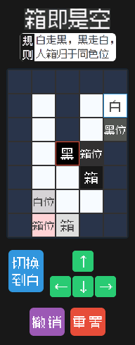
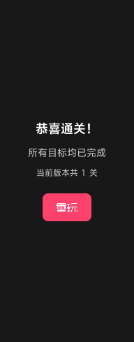
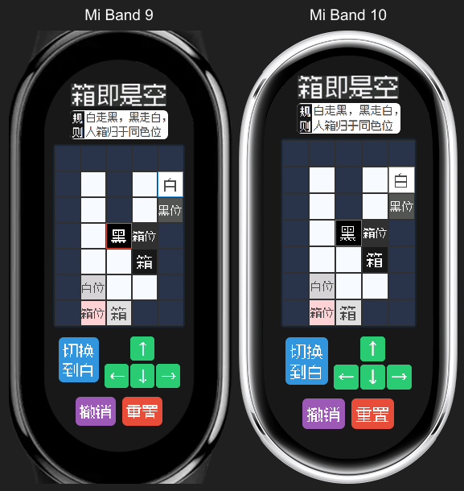
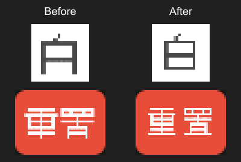
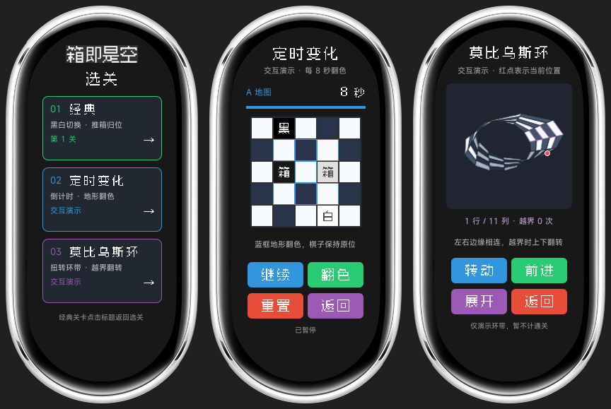
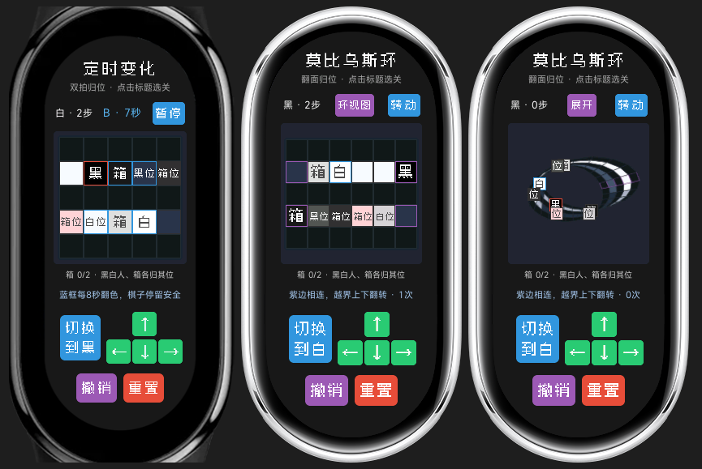

# 优化与验证记录

验证日期：2026-09-21。环境：Windows、Node.js 24.21.0、aiot-toolkit 2.0.5；模拟器使用本机的 Vela-watch-5.0 镜像。

## 已修复与优化

- 引入 `@system.prompt`，修复无效移动和空撤销的提示调用。
- 使用 `device.getInfo().screenWidth` 适配屏幕；设备信息返回前和获取失败时都有默认尺寸。
- 修复胜利页的参数读取和重玩路由，使用 `replace` 避免每次通关增加页面栈；当前只有一关，移除无实际下一关的按钮。
- 每个按钮单独管理反馈定时器，离开页面时清理。
- 游戏和撤销历史退出模板的响应式状态；一次移动只计算一次棋盘和胜利状态，保留格子对象并只更新变化的属性。
- 目标点缓存整关复用，箱子缓存只在推箱、撤销和初始化时更新；复制初始关卡数据，保证重置不会受到之前推箱操作影响。
- 补齐步数初始化与撤销恢复；修复动态角色边框被固定样式覆盖。
- 空图标路径使用空字符串，避免模拟器拒绝 `null` 属性更新。移除不受当前模拟器支持的 emoji 和 `gap` 样式；现有按钮 margin 保持间距。
- 原始标题图移至 `docs/assets`，不进入 RPK；新增 ESLint 配置和自动测试。

## 验证结果

| 检查 | 结果 |
| --- | --- |
| `npm test` | 19 项全部通过 |
| `npm run lint` | 通过 |
| `npm run build` | 通过 |
| 移动、推箱、两色地形规则、边界与障碍 | 自动测试通过，并实际运行通关路线 |
| 撤销、重置、无操作可撤销提示 | 自动测试及模拟器验证通过 |
| 按钮交替点击、重复点击和页面销毁后的定时器 | 自动测试通过 |
| 192×490 / 212×520 布局 | 两个模拟器均正常显示棋盘和操作按钮 |
| 第一关完整通关、胜利页、重玩 | 两个模拟器均通过 |

通关路线保存在 `tests/fixtures/level01-solution.json`，共 37 次操作：34 次移动、3 次角色切换。模拟器使用实际触控操作执行该路线，并非修改游戏状态直接触发胜利。

优化完成时的调试包为 48,475 字节（约 47.3 KiB）；当前接入像素单字后的包体积见下文。构建产物不再包含 `title_original.png`。

## 模拟器已知异常与验证边界

本机 Vela-watch-5.0 模拟器在 `am stop com.boxorvoid.demo` 后再次 `am start com.boxorvoid.demo`，会出现 NuttX 原生 data abort。对照测试使用 Git `cc94578` 中原有的 `dist/com.boxorvoid.demo.release.1.1.0.rpk`（581,111 字节），也复现了相同异常：`arm_dataabort`，PC `0060a7b0`，DFAR `31306c65`，任务 `vappxms`。因此这不是本次修改独有的问题；具体底层原因未定位，不能认为已修复。复现后需重启整个模拟器。

冷启动后的正常游戏、通关和页面内重玩已验证通过。本次未连接小米手环真机，尚不能确认真机性能、功耗及固件兼容性；也未测量 FPS 或内存峰值。

## 模拟器截图

| 手环 9：通关 / 重玩 | 手环 10：通关 / 重玩 |
| --- | --- |
|  |  |
|  |  |

## Ark Pixel 单字接入验证

2026-09-21，接入 Ark Pixel 12px Mono zh_cn 单字素材。替换 20 张现有汉字图标，新增“玩”字；胜利页“重玩”改为两张图片，仍由原按钮处理点击。方向箭头、布局、配色和游戏规则保持原样。选关与新关卡的其他字符尚未接入游戏。

- `npm run assets:sync` 校验并同步 21 张 PNG，共 3,881 字节。
- `npm run lint`、`npm test`（19 项）和 `npm run build` 全部通过。
- 手环 9（192×490）与手环 10（212×520）模拟器均冷启动安装新包，确认棋盘与按钮字形完整、无缺图。
- 两台模拟器都实际点击移动、撤销、切换角色、重置；移动后撤销，以及切换角色后重置，截图解码像素均与初始画面完全一致。
- 两台模拟器都通过 37 次实际触控完成第一关；点击胜利页“重玩”的字图本身能够返回关卡，重玩截图解码像素与初始画面完全一致。
- 单字接入阶段调试包：47,114 字节（约 46.0 KiB）。后续安全区修复的当前包体积见下文。未在手环真机验证。

| 手环 9：新字图 / 通关 | 手环 10：新字图 / 通关 |
| --- | --- |
|  |  |
|  |  |

## 圆弧安全区修复与验证

2026-09-21，用户在带机身边框的模拟器中发现标题和底部按钮被裁切。此前只检查了矩形帧缓冲截图，遗漏了胶囊屏圆弧遮罩，因此前面的“正常显示”结论不足以覆盖实际可见区域。

本次修复：

- 同时读取 `screenWidth` 与 `screenHeight`，按宽高缩放比例的较小值适配，防止手环 10 的宽度放大导致整页超高。缺少高度时使用对应手环的保守默认值。
- 为页面顶部、底部分别预留安全空间，标题按明确宽高居中；缩小棋盘格和部分空隙，控制区域居中。保留原有颜色、单字图片及按钮排列。
- 去除撤销、重置字图的多余内外边距，双字目标标签限制在扣除格子边框后的可用宽度内。

验证结果：

- `npm run lint`、`npm test`（20 项）、`npm run build` 全部通过。布局测试覆盖双字标签容纳宽度、同高度屏幕不随宽度纵向放大，以及缺失/异常设备尺寸。
- 两款模拟器冷启动安装新包后，检查实际帧缓冲与 SDK `xiaomi_band` / `xiaomi_band_10` 的原始 `foreground.png` 遮罩。任一非背景像素与非透明遮罩重叠即计入遮挡，结果见 `safe-area-report.json`。
- 手环 9 的遮挡像素从 331 降为 0，手环 10 从 2,132 降为 0。该检查针对当前游戏画面，不代表其他硬件或固件的安全区测量。
- 两款模拟器都验证移动、撤销、角色切换、重置，并通过 37 次触控完整通关。撤销、重置及胜利页重玩后的帧缓冲均与各自初始画面逐像素一致。
- 安全区修复阶段调试包：47,337 字节（约 46.2 KiB）。后续字图底边修复的当前包体积见下文。未进行真机验证。

下面是实际模拟器截图叠加 SDK 原始机身与圆弧遮罩后的预览，原始矩形截图另存为 `safe-area-miband9-game.png` 与 `safe-area-miband10-game.png`：

## 单字底部笔画裁切修复

2026-09-21，手环 9 上仍有字图底部笔画丢失。放大帧缓冲可见“白”缺少最下方横线，“重置”最下方横线也不完整。源 PNG 的笔画完整，但字模最后一行贴着 48px 画布底边，在模拟器缩小显示时被裁切；此前的机身遮罩检查无法检测这种图片内部的裁切。

修复应用中的 21 张字图：同步脚本保留源图所有像素，左右各加 4px、底部加 8px 透明留白，生成 56×56 的运行时副本，隔开笔画和缩放边缘。素材库中的 48×48 原图保持不变。字图控件显式使用 `object-fit: contain`；单独设置此属性不足以修复本次问题，透明留白是此次验证有效的改动。棋盘、按钮及页面的尺寸与位置保持不变。

- `npm run assets:sync` 校验 21 张运行时 PNG 的尺寸、透明底边，以及去掉留白后与源字模逐像素一致；总计 4,053 字节。
- `npm run lint`、`npm test`（20 项）和 `npm run build` 全部通过。
- 手环 9 实际截图中，“白”的长横线从 2 组恢复为 3 组，最下方横线恢复。逐行检测结果见 `glyph-bottom-strokes.json`；同时放大检查“黑”的四点底、双字目标标签、切换和撤销/重置按钮。
- 手环 9、10 都完成移动、撤销及 37 次触控通关，胜利页的像素字“重玩”也完整显示。两款设备的机身遮罩遮挡像素仍为 0。
- 单字底边修复阶段调试包：47,532 字节（约 46.4 KiB）。后续新增演示页面的当前包体积见下文。未进行真机验证。

下图从手环 9 的修复前后实际截图裁取，使用最近邻放大展示“白”和“重置”的底部笔画：

## 选关、定时变化与莫比乌斯环演示

2026-09-21，新增选关入口及两个独立交互演示页面。经典关卡继续可玩，新模式明确标注“交互演示”，尚未作为可通关的新关卡。使用方式、路由和实现说明见 `docs/mode-demos.md`。

- `npm run assets:sync` 同步 63 张运行时字图；`npm run assets:mobius` 生成 12 个莫比乌斯环投影视角。
- `npm test` 共 28 项通过，新增覆盖选关路由、计时器暂停/后台/销毁、仅翻转指定地形、接缝行翻转、投影闭合及字图/环带资源有效性。`npm run lint`、`npm run build` 均通过。
- 手环 9 与手环 10 模拟器均通过选关进入三个模式，定时地图自动翻色、暂停超过一个完整周期、暂停时手动翻色、重置与返回。
- 两台模拟器都检查转动视角、切换展开图和前进。红点从第 1 行第 11 列前进两次，到达第 5 行第 1 列，越界次数变为 1；模型测试进一步确认两圈回到原行。
- 两台模拟器的经典初始棋盘与前一版逐像素一致，并再次执行 37 次触控完成经典关卡。手环 9 验证胜利页进入选关；手环 10 验证胜利页重玩、点击经典标题返回选关。
- 选关、定时、环视图、展开图分别与两款 SDK 机身遮罩做像素比对，8 个检查结果均为 0 遮挡像素，见 `modes-safe-area.json`。
- 演示阶段调试包：`dist/com.boxorvoid.demo.debug.1.1.0.rpk`，225,778 字节（约 220.5 KiB）。未测试真机功耗、峰值内存或帧率。

手环 10 的实际画面叠加 SDK 官方机身边框，依次为选关、定时变化、莫比乌斯环：

手环 9、10 的原始截图分别保存在 `modes-miband9-*.png` 与 `modes-miband10-*.png`。

## 定时变化与莫比乌斯环可通关教学关

2026-09-21，将上述两个演示页升级为完整教学关：“双拍归位”和“翻面归位”。详细规则、坐标和参考解法见 [关卡设计](../playable-levels.md)。

- `npm test` 共 **38 项通过**，`npm run lint`、`npm run build` 通过。测试包含两个新关卡的完整解法、正确的胜利重玩路由、精确剩余时间、暂停/后台/销毁、地图和箱子撤销、双向跨缝推箱与占位阻挡。
- 可达状态搜索验证：两关均可通关；禁用定时翻色或横向接缝后均不可通关。参考解法分别为 6 次、8 次成功移动，另外包含切换角色和等待。
- Mi Band 9（192×490）和 Mi Band 10（212×520）模拟器均冷启动安装新包，通过实际触控完整完成两个新关卡。胜利页正确显示对应模式，重玩回到该模式的初始关卡，标题可返回选关。
- 定时关在两台设备实测 A→B 自动翻色后分别推两个箱子，B→A 后暂停、撤销，确认地图恢复到上一步的 B 状态；继续游戏后再次等到 A 状态完成通关。暂停时画面保持不变，方向和切换角色无效。
- 环形关在两台设备实测箱子先跨缝、角色随后跨缝，展开图正确显示从上排最右侧到下排最左侧。转动视角、切换环视图、撤销和重置可用。两台设备重置和胜利后重玩画面与初始画面逐像素一致。
- 两台设备经典关卡的初始画面与上次已验证截图逐像素一致，并各执行原来的 37 次触控操作完成通关。
- 选关、定时 A/B、环形展开/投影/跨缝和三种胜利画面，与两款 SDK 原始胶囊屏遮罩比对：**18 项检查均为 0 遮挡像素**，见 [遮挡报告](playable-safe-area.json)。字图继续保留透明底边，放大检查角色、目标和控制按钮的像素字。
- 当前调试包：`dist/com.boxorvoid.demo.debug.1.1.0.rpk`，**249,645 字节（约 243.8 KiB）**。包的 SHA-256 及验证范围记录在 `playable-build.json`。未进行真机验证或功耗、峰值内存测量。

下图依次为手环 9 定时关 B 地图、手环 10 箱子越过接缝后的展开图、手环 10 环视图。均为实际模拟器截图叠加官方 SDK 机身边框：

原始截图保存为 `playable-miband9-*.png` 和 `playable-miband10-*.png`；`*-timed-win.png`、`*-mobius-win.png` 为两种新模式的通关画面。
